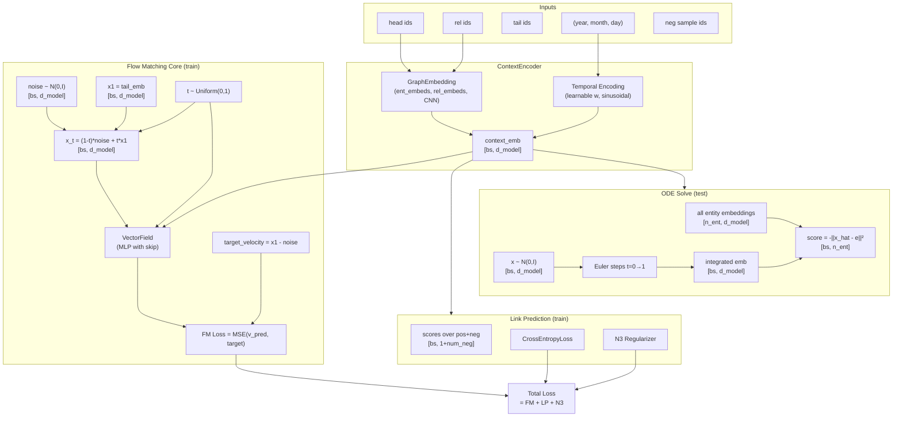

# Design Document: Matching Flow TKG (`matching-flow-tkg`)

## Overview

This document describes the design for `MatchingFlowTKG`, a new temporal knowledge graph (TKG) link-prediction model that uses **conditional flow matching** as its generative backbone. It is designed as a drop-in alternative to the existing `NoName` diffusion model: same config interface, same `train_forward` / `test_forward` signatures, same dataset pipeline, and same evaluation loop in `main.py`.

### Design Goals

- Provide a continuous normalizing flow approach that maps a standard Gaussian source distribution to the distribution of target tail entity embeddings, conditioned on `(head, relation, year, month, day)`.
- Reuse `GraphEmbedding` for entity/relation embeddings to keep the embedding space consistent with the baseline.
- Combine a flow-matching regression loss with a link-prediction loss and N3 regularization, mirroring the multi-objective training used by `NoName`.
- Require no structural changes to `main.py`, `dataset.py`, `GraphEmbedding.py`, `Denoiser.py`, or `model.py`.

### Key Design Decisions

| Decision | Rationale |
|---|---|
| Conditional Flow Matching (CFM) over DDPM | CFM uses a simple MSE regression target (velocity), trains with a single forward pass, and integrates deterministically at test time — simpler than score-based diffusion. |
| Euler ODE solver at test time | Straightforward to implement, deterministic, and sufficient for 10–20 integration steps over a short unit-time interval. |
| Negative-distance scoring at test time | Matches the implicit geometry of the flow output and is consistent with how `NoName` uses dot-product scores. |
| Single `GraphEmbedding` instance | Keeps the embedding space unified (one embedding table per entity/relation), matching the `NoName` pattern. |
| Learnable sinusoidal frequency vector `w` | Matches the pattern already used in `NoName` and `Tero`, allowing the model to tune how it encodes temporal information. |

---

## Architecture



---

## Components and Interfaces

### 1. `VectorField` (new, in `models/MatchingFlow.py`)

A feed-forward MLP that predicts the velocity vector given a noised sample, a scalar flow-time embedding, and the context vector.

**Input:** concatenation of `[x_t, time_emb, context_emb]` → shape `(batch_size, 3 * d_model)`

**Output:** velocity vector of shape `(batch_size, d_model)`

**Architecture:**
```
Linear(3*d_model, 4*d_model) → LayerNorm → ReLU → Dropout
Linear(4*d_model, 2*d_model) → LayerNorm → ReLU → Dropout
Linear(2*d_model, d_model)
+ skip connection: Linear(3*d_model, d_model) added to final output
```

**Rationale for skip connection:** Ensures a stable gradient path from the conditioning signal to the output, mirroring residual designs in `Denoiser.py` and `GraphEmbedding.py`.

**Key method:**
```python
def forward(self, x_t: Tensor, time_emb: Tensor, context_emb: Tensor) -> Tensor:
    # x_t:       (bs, d_model)
    # time_emb:  (bs, d_model)
    # context_emb: (bs, d_model)
    # returns:   (bs, d_model)
```

---

### 2. `MatchingFlowTKG` (new, in `models/MatchingFlow.py`)

The top-level `nn.Module`. Orchestrates embedding, context encoding, flow sampling, denoising, and scoring.

**Constructor signature:**
```python
class MatchingFlowTKG(nn.Module):
    def __init__(self, config, ode_steps: int = 10):
        # config: namedtuple with n_ent, n_rel, d_model, dropout
        # ode_steps: number of Euler integration steps at test time
```

**Submodules:**
| Attribute | Type | Purpose |
|---|---|---|
| `self.encoder` | `GraphEmbedding` | Entity/relation embeddings + CNN context encoding |
| `self.vector_field` | `VectorField` | Predicts velocity for flow matching |
| `self.emb_regularizer` | `N3(0.004)` | Cubic regularizer on embedding factors |
| `self.w` | `nn.Parameter (d_model,)` | Learnable sinusoidal temporal frequency vector |
| `self.time_mlp` | `nn.Linear(d_model, d_model)` | Projects sinusoidal time embedding to d_model |
| `self.lp_loss_fn` | `nn.CrossEntropyLoss` | Cross-entropy for link prediction |
| `self.dropout` | `nn.Dropout(dropout)` | Applied before scoring |

---

### 3. `ContextEncoder` (logical sub-component within `MatchingFlowTKG`)

Not a separate class — implemented as a sequence of operations inside `MatchingFlowTKG`:

1. **Temporal encoding**: Given `(year, month, day)`, combine them to a scalar time signal and apply the learnable sinusoidal frequencies `w`:
   ```python
   time_signal = month + day % month + year % month   # scalar per sample (matches NoName pattern)
   d_real = torch.sin(self.w * time_signal)            # shape (bs, d_model)
   d_img  = torch.cos(self.w * time_signal)            # shape (bs, d_model)
   ```
2. **Head/relation embedding**: `self.encoder.get_ent_embedding(heads)` and `self.encoder.get_rel_embedding(rels)`.
3. **Query embedding**: Form `query_emb = head_emb + rel_emb` (additive, shape `(bs, d_model)`).
4. **Context encoding**: `context_emb = self.encoder(query_emb, d_real)` → `(bs, d_model)` via the CNN in `GraphEmbedding.forward`.

---

### 4. Scalar Flow-Time Embedding (within `MatchingFlowTKG`)

During training, a continuous scalar `t ∈ [0, 1]` is drawn per sample. It is embedded with the same sinusoidal scheme used for diffusion timesteps in `NoName`:

```python
freqs = torch.exp(-log(10000) * arange(0, d_model//2) / (d_model//2))
temp  = t_scalar[:, None] * freqs[None]             # (bs, d_model//2)
t_emb = cat([cos(temp), sin(temp)], dim=-1)          # (bs, d_model)
t_emb = self.time_mlp(t_emb)                         # (bs, d_model)
```

---

## Data Models

### Config Interface

`MatchingFlowTKG` consumes the same `Config` namedtuple already built in `main.py`:

```python
Config = namedtuple('config', ['n_ent', 'd_model', 'n_rel', 'dropout', 's_emb_dim', 't_emb_dim'])
config = Config(
    n_ent    = dataset.numEnt() + 1,
    n_rel    = dataset.numRel() * 2,
    d_model  = args.d_model,           # default 200
    dropout  = args.dropout,           # default 0.1
    s_emb_dim = 64,
    t_emb_dim = 36,
)
```

`MatchingFlowTKG.__init__` only reads `config.n_ent`, `config.n_rel`, `config.d_model`, and `config.dropout`. The `s_emb_dim` and `t_emb_dim` fields are ignored (they are DE_SimplE artifacts).

### Tensor Shapes (Training)

| Variable | Shape | Description |
|---|---|---|
| `heads`, `rels`, `tails` | `(bs,)` | Integer entity/relation IDs |
| `year`, `month`, `day` | `(bs,)` | Temporal components (float after `convertTimes`) |
| `neg` | `(bs, 500)` | Negative tail samples (from `QuadruplesDataset.__getitem__`) |
| `noise` | `(bs, d_model)` | Gaussian noise sample |
| `t_scalar` | `(bs,)` | Uniform flow time in [0, 1] |
| `x_t` | `(bs, d_model)` | Interpolated sample |
| `v_pred` | `(bs, d_model)` | Predicted velocity from `VectorField` |
| `target_v` | `(bs, d_model)` | Target velocity = `x1 - noise` |
| `context_emb` | `(bs, d_model)` | Conditioning vector |
| `pos_tail_emb` | `(bs, d_model)` | `encoder.get_ent_embedding(tails)` |
| `neg_tail_emb` | `(bs, 500, d_model)` | `encoder.get_ent_embedding(neg)` |
| `lp_scores` | `(bs, 501)` | Scores for pos + 500 neg |

### Tensor Shapes (Evaluation)

| Variable | Shape | Description |
|---|---|---|
| `x_t` | `(bs, d_model)` | Starts as Gaussian noise; updated in-place by Euler steps |
| `all_ent_embs` | `(n_ent, d_model)` | Full entity embedding matrix |
| `scores` | `(bs, n_ent)` | Negative L2 distance to all entities |

### Loss Computation

```
total_loss = fm_loss + lp_loss + reg_loss

fm_loss  = MSE(v_pred, target_v)                  # flow matching regression
lp_loss  = CrossEntropy(lp_scores, zeros(bs))     # rank positive above negatives
reg_loss = N3(head_emb, rel_emb, tail_emb factors) # cubic L3 norm on embeddings
```

### Scoring Function (test time)

The score for candidate entity `e` given integrated embedding `x_hat`:

```
score(e) = -|| x_hat - all_ent_embs[e] ||²
```

Higher score → better candidate. Shape returned: `(bs, n_ent)`.

### Model Selection in `main.py`

A minimal addition to `main.py` selects the model class:

```python
from models.MatchingFlow import MatchingFlowTKG

MODEL_REGISTRY = {
    'DifTKG':       NoName,
    'MatchingFlow': MatchingFlowTKG,
}

if args.model_name not in MODEL_REGISTRY:
    raise ValueError(f"Unknown model '{args.model_name}'. Valid: {list(MODEL_REGISTRY.keys())}")
model = MODEL_REGISTRY[args.model_name](config)
```

No other changes to `main.py` are needed.

---

## Error Handling

| Scenario | Handling |
|---|---|
| Unknown `--model_name` | `ValueError` raised with list of valid names before any training starts |
| Dimension mismatch (config `d_model` changed) | PyTorch will raise a `RuntimeError` on mismatched `mm` / `matmul` — no custom handling needed; the unified `d_model` throughout ensures this does not happen for valid configs |
| `ode_steps <= 0` | Guard in `test_forward`: raise `ValueError("ode_steps must be >= 1")` |
| `neg` shape mismatch | `QuadruplesDataset` always returns `neg` of shape `(500,)` per sample, which stacks to `(bs, 500)` in the DataLoader — no special handling needed |
| CUDA not available | Handled by existing `main.py` device selection logic; `MatchingFlowTKG` uses standard `nn.Module` device placement and does not hard-code `.cuda()` (unlike `NoName`, which has a few `.cuda()` calls in `get_betas`) |

---

## Correctness Properties

*A property is a characteristic or behavior that should hold true across all valid executions of a system — essentially, a formal statement about what the system should do. Properties serve as the bridge between human-readable specifications and machine-verifiable correctness guarantees.*

### Property 1: MatchingFlowTKG instantiates for any valid config and produces correct method signatures

*For any* valid configuration (varying `n_ent`, `n_rel`, `d_model`, `dropout`), instantiating `MatchingFlowTKG` with that config shall succeed without error, and the resulting model shall expose `train_forward` and `test_forward` as callable methods.

**Validates: Requirements 1.2, 1.3**

---

### Property 2: Context embedding dimension invariant

*For any* valid batch of query inputs (arbitrary head entity IDs, relation IDs, year/month/day values, and any `d_model`), the context embedding produced by `MatchingFlowTKG`'s context encoder shall always have shape `(batch_size, d_model)`.

**Validates: Requirements 2.2, 3.1, 3.2, 10.3**

---

### Property 3: VectorField output dimension invariant

*For any* valid batch (arbitrary `x_t`, `time_emb`, `context_emb` tensors of matching batch size and dimension `d_model`), the `VectorField`'s output shall always have shape `(batch_size, d_model)`.

**Validates: Requirements 4.1**

---

### Property 4: Flow-matching loss non-negativity and zero-at-identity

*For any* valid training batch (arbitrary head, relation, tail, temporal, and negative sample inputs), `train_forward` shall return a non-negative scalar tensor. Furthermore, if the predicted velocity exactly equals the target velocity `(x_1 - noise)`, the flow-matching component of the loss shall equal zero.

**Validates: Requirements 4.4, 5.1, 5.2, 5.4, 5.5**

---

### Property 5: test_forward output shape invariant

*For any* valid evaluation batch (arbitrary batch size, entity IDs, relation IDs, temporal inputs) and `MatchingFlowTKG` with `n_ent` entities, `test_forward` shall return a tensor of exactly shape `(batch_size, n_ent)`.

**Validates: Requirements 2.3, 6.1, 6.2, 8.1, 8.3, 10.2**

---

### Property 6: Highest-scoring entity is nearest neighbor

*For any* test batch, the entity assigned the highest score by `test_forward` for a given query shall be the entity embedding with the smallest L2 distance to the Euler-integrated embedding for that query.

**Validates: Requirements 6.3**

---

### Property 7: Model registry dispatches correctly and rejects unknown names

*For any* model name in the valid registry (`DifTKG`, `MatchingFlow`), the registry shall instantiate the corresponding model class. *For any* string not in the registry, the registry shall raise a `ValueError`.

**Validates: Requirements 7.1, 7.2, 7.3**

---

## Testing Strategy

### Dual Testing Approach

Both unit tests and property-based tests are used together:

- **Unit tests** validate specific concrete behaviors, structural checks (file existence, import paths, parameter counts), and boundary conditions (t=0, t=1 interpolation correctness; ode_steps=0 guard).
- **Property-based tests** (Hypothesis) validate universal invariants across the full input space.

### Property-Based Testing Library

**Hypothesis** (`hypothesis` Python package). All property tests use `@settings(max_examples=100)` as the minimum. CPU-only tensors are used in property tests to keep iteration cost low (no GPU required for shape and loss invariant tests).

### Property Test Configuration

Each property test is tagged:

```python
# Feature: matching-flow-tkg, Property N: <property_text>
@settings(max_examples=100)
@given(...)
def test_property_N_...(...)
```

### Unit Test Checklist

- `MatchingFlowTKG` is importable from `models.MatchingFlow`
- `model.encoder` is an instance of `GraphEmbedding`
- `model.w` is an `nn.Parameter` with `requires_grad=True`
- Flow interpolation: at `t=0`, `x_t == noise`; at `t=1`, `x_t == x_1`
- `ode_steps=0` raises `ValueError`
- Unknown `--model_name` raises `ValueError` with message listing valid names
- `model.py` file hash is unchanged after adding `models/MatchingFlow.py`

### Integration Test Checklist

- Full training loop runs for 1 epoch with `--model_name MatchingFlow` without error
- `test()` produces all six metric keys for `MatchingFlowTKG` output
- `--model_name DifTKG` still produces identical metrics to pre-feature baseline (with fixed seed)
